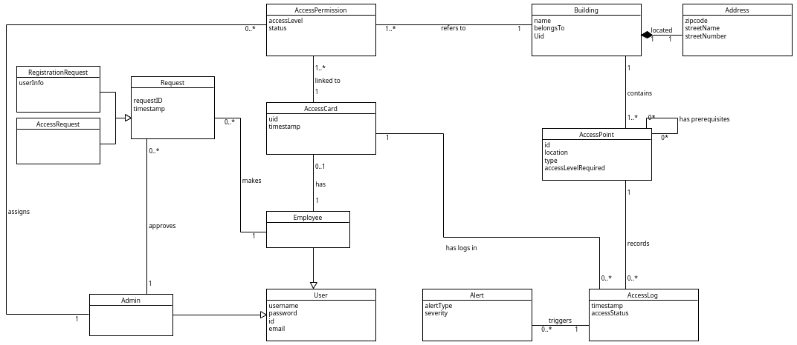

# Ομάδα 4 - Σύστημα ελέγχου πρόσβασης κτιριακών εγκαταστάσεων

Η  εργασία αφορά την ανάπτυξη ενός συστήματος διαχείρισης εισόδου για κτιριακές εγκαταστάσεις, το οποίο θα επιτρέπει την ασφαλή και αποτελεσματική παρακολούθηση και διαχείριση της πρόσβασης στους διάφορους χώρους ενός κτιρίου. Σκοπός της εφαρμογής είναι η εξασφάλιση ότι μόνο οι εξουσιοδοτημένοι υπάλληλοι έχουν πρόσβαση σε συγκεκριμένες περιοχές, ενισχύοντας την ασφάλεια και προστατεύοντας τα ευαίσθητα δεδομένα και υποδομές.

## Απαιτήσεις Λογισμικού

### Κύριες Λειτουργίες του Συστήματος:
- __Καταγραφή Χρηστών:__ Οι υπάλληλοι θα καταχωρούν τα στοιχεία τους στο σύστημα, το οποίο θα εκδίδει ηλεκτρονικές κάρτες πρόσβασης για την επιβεβαίωση της ταυτότητας τους.

- __Διαχείριση Δικαιωμάτων Πρόσβασης:__ Το σύστημα θα επιτρέπει τον καθορισμό και τη διαχείριση δικαιωμάτων πρόσβασης για κάθε χρήστη, διασφαλίζοντας ότι οι χρήστες έχουν πρόσβαση μόνο σε περιοχές που είναι κατάλληλες για αυτούς.

- __Παρακολούθηση Εισόδου/Εξόδου:__ Όλες οι είσοδοι και έξοδοι από το κτίριο θα καταγράφονται, παρέχοντας πληροφορίες για την ακριβή ώρα και ημερομηνία πρόσβασης.

- __Δημιουργία Ειδοποιήσεων:__ Το σύστημα θα παρέχει τη δυνατότητα δημιουργίας ειδοποιήσεων σχετικά με παράνομες προσπάθειες πρόσβασης ή άλλες ασφαλιστικές παραβάσεις.

### 1. Καταγραφή Χρηστών

- Ο χρήστης κάνει αίτημα εγγραφής στο σύστημα, παρέχοντας τα προσωπικά του στοιχεία.

- Η εγγραφή και έκδοση των ταυτοτήτων πρόσβασης θα γίνεται από την ομάδα διαχείρισης, μετά από αίτημα των χρηστών.

### 2. Διαχείριση Δικαιωμάτων Πρόσβασης

- Το σύστημα επιτρέπει την ανάθεση δικαιωμάτων πρόσβασης σε χρήστες, εξασφαλίζοντας ότι κάθε άτομο μπορεί να εισέλθει μόνο σε προκαθορισμένους χώρους βάσει των αναγκών του και του επιπέδου ασφαλείας που έχει καθοριστεί για κάθε περιοχή.

- Οι χρήστες θα μπορούν, μέσω σύνδεσης στην εφαρμογή, να διαχειρίζονται τα προσωπικά τους στοιχεία, αλλά η αίτηση για την έκδοση ταυτότητας και για αλλαγές στα δικαιώματα πρόσβασης θα γίνεται αποκλειστικά από την ομάδα διαχείρισης.

### 3. Καταγραφή Κτιρίων και Σημείων Ελέγχου

- Η ομάδα διαχείρισης της υπηρεσίας θα καταγράφει τα κτίρια και τα σημεία ελέγχου πρόσβασης.

- Κάθε κτίριο και σημείο ελέγχου θα έχει συγκεκριμένα χαρακτηριστικά, ώστε να ορίζονται οι περιοχές πρόσβασης για κάθε χρήστη.

### 4. Παρακολούθηση Εισόδου/Εξόδου

- Το σύστημα καταγράφει αυτόματα την ώρα και ημερομηνία πρόσβασης κάθε χρήστη σε κάθε χώρο, αποθηκεύοντας το ιστορικό των κινήσεών τους στο σύστημα.

### 5. Αποστολή Ειδοποιήσεων Ασφαλείας

- Σε περίπτωση παραβίασης ασφαλείας, όπως όταν ένας χρήστης προσπαθεί να χρησιμοποιήσει την κάρτα του σε σημείο ελέγχου που δεν είναι εξουσιοδοτημένος να περάσει, το σύστημα θα αποστέλλει αυτόματα ειδοποίηση στην ομάδα διαχείρισης μέσω μηνυμάτων ή άλλου μηχανισμού ειδοποιήσεων.

### 6. Δημιουργία Αναφορών

- Το σύστημα θα παρέχει αναφορές σχετικά με τα άτομα που βρίσκονται σε κάθε κτιριακή εγκατάσταση βάσει των ελέγχων πρόσβασης

## Παραδοχές

- __Κλειστά Περιβάλλοντα:__ Το σύστημα προορίζεται για περιβάλλοντα με συγκεκριμένες, προσδιορισμένες κτιριακές εγκαταστάσεις (π.χ., επιχειρήσεις, νοσοκομεία), όπου απαιτείται ελεγχόμενη πρόσβαση. 

- __Υπάλληλοι:__ Οι υπάλληλοι έχουν μακροχρόνια δικαιώματα πρόσβασης.

- __Δικαιώματα Πρόσβασης:__ Οι χρήστες έχουν δικαιώματα πρόσβασης μόνο σε περιοχές που τους αναλογούν βάσει του επιπέδου πρόσβασης που τους έχει δοθεί με βάση την θέση και τον ρόλο τους. Ορίζουμε ως επίπεδα πρόσβασης  ως εξής: 

    - __Επίπεδο 1 - Βασική Πρόσβαση (Basic Access):__ 

        - __Αριθμός:__ 1 

        - __Περιγραφή:__ Το επίπεδο αυτό παρέχει πρόσβαση μόνο σε βασικές περιοχές του κτιρίου, όπως κοινόχρηστοι χώροι (π.χ., είσοδοι, χώροι αναμονής, κουζίνα). 

        - __Ρόλοι:__ Συνήθως το έχουν εξωτερικοί συνεργάτες, επισκέπτες ή υπάλληλοι με περιορισμένες αρμοδιότητες. 

    - __Επίπεδο 2 - Ελεγχόμενη Πρόσβαση (Controlled Access):__ 

        - __Αριθμός:__ 2 

        - __Περιγραφή:__ Αυτό το επίπεδο επιτρέπει πρόσβαση σε πιο εξειδικευμένους χώρους, όπως γραφεία ή αίθουσες συσκέψεων, αλλά όχι σε περιοχές υψηλής ασφάλειας. 

        - __Ρόλοι:__ Ανατίθεται σε εργαζόμενους που χρειάζονται πρόσβαση σε χώρους εργασίας, χωρίς να απαιτείται πρόσβαση σε ευαίσθητες περιοχές του κτιρίου. 

    - __Επίπεδο 3 - Πρόσβαση Υψηλής Ασφάλειας (High-Security Access):__

        - __Αριθμός:__ 3 

        - __Περιγραφή:__ Το επίπεδο αυτό παρέχει πρόσβαση σε όλες τις περιοχές του κτιρίου, συμπεριλαμβανομένων ευαίσθητων και περιορισμένων χώρων, όπως data centers, ελεγχόμενα δωμάτια ή αποθήκες σημαντικών αρχείων. 

        - __Ρόλοι:__ Συνήθως ανατίθεται σε υψηλόβαθμα στελέχη, διαχειριστές συστήματος ή εξουσιοδοτημένο προσωπικό ασφαλείας. 

- __Διαχειριστές:__ Η διαχείριση των χρηστών, η καταχώρηση των κτιρίων και των σημείων ελέγχου, καθώς και ο καθορισμός δικαιωμάτων πρόσβασης γίνονται από την ομάδα διαχείρισης του συστήματος.
- __Αιτήματα:__ 

    - __Παραδοχή 1:__   Θεωρούμε πως τα request θα γίνονται σε πραγματικό χρόνο, οπότε και κάθε φορά θα υπάρχει ένας συγκεκριμένος admin που θα τα διαχειρίζεται.

    - __Παραδοχή 2:__   Θεωρούμε πως υπάρχουν δύο είδη request. Το αίτημα εγγραφής, το οποίο γίνεται σε κάθε περίπτωση αποδεκτό από έναν συγκεκριμένο admin ο οποίος καταχωρεί τα στοιχεία του πελάτη στο σύστημα. Το αίτημα ανάθεσης δικαιωμάτων πρόσβασης, το οποίο γίνεται αποδεκτό από τον admin που αναλαμβάνει την διαχείριση των δικαιωμάτων πρόσβασης.

## Μοντέλο Πεδίου
